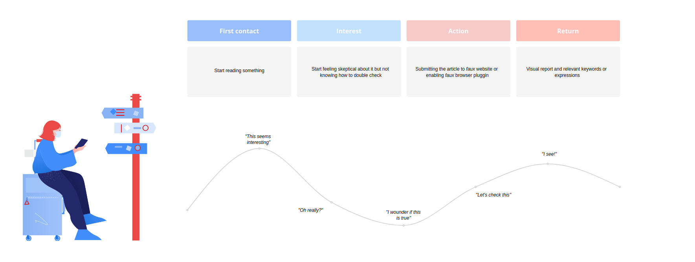

## About our users

The following list is meant to give a general overview of the kind of 
users we have.

#### The regular one

These are people that want to be well informed and usually fact-check 
articles with others. For them, _faux_ is an opportunity to get part 
of this job done.

#### The big one

These are companies, mostly social network platforms, that want to 
include new functionality in their product. Precisely, the ability 
to flag potentially fake or hazardous content for their users.

#### The involved-with-the-cause one

These are the many organizations that try to dismantle unproven and
pseudoscientific health recommendations in favor of evidence-based 
information. There're two ways we can benefit from each other here:

- By providing a tool meant to flag this type of content.
- By receiving new heuristics to help us better detect harmful information.

  

## Carla's user journey

Carla is bored at the airport and decides to go on Instagram. 
She stumbles upon a magazine post about NPL (Neuro-linguistic 
programming), which she has no idea what it is. She's not 
boarding anytime soon, so she goes ahead ready to dive into it. 
It has something to do with personal growth and apparently is 
a way of dealing with depression, which might be interesting. 
She keeps reading until the article starts sounding kind of 
babble. She wonders if any of this makes any sense and goes 
over to faux.io to submit the article. Carla is assisted 
with a visual report and a few problematic keywords mentioned 
in the article. Sadly, it looks like something not to be taken 
too seriously. She goes back to Instagram but this time she 
will be looking at ramen recipes.

*Note*: If Carla had been on desktop, she could have used the
faux browser plugin instead.

Illustration by [Natasha Remarchuk](https://icons8.com/illustrations/author/5e7e24ce01d0360013bb7479)
from [Ouch!](https://icons8.com/illustrations)

